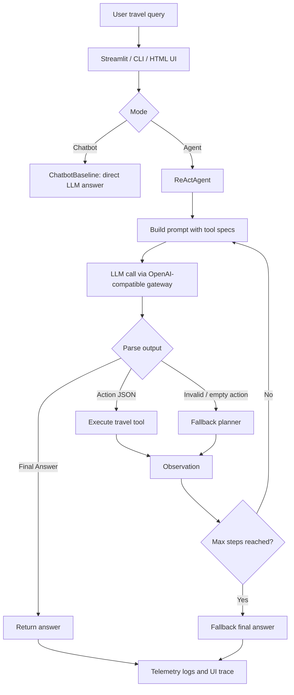

# Group Report: Lab 3 - Production-Grade Agentic System

- **Team Name**: Vin Travel Concierge Agent
- **Team Members**:
  - Trần Quốc Khánh - 2A202600679
  - Nguyễn Anh Kiệt - 2A202600677
  - Nguyễn Văn Huy - 2A202600773
  - Nhan Khánh Đình - 2A202600673
  - Nguyễn Ngọc Hảo - 2A202600903
- **Deployment Date**: 2026-06-01
- **Demo Domain**: Vin/Vinpearl/VinWonders travel concierge for Phú Quốc and Nha Trang

---

## 1. Executive Summary

The project implements a direct chatbot baseline and a ReAct-style agent for the same travel planning task. The baseline answers from the LLM directly, while the agent can call structured travel tools, collect observations, and produce an itinerary with cost estimate, warnings, and source URLs.

- **Success Rate**: 17/17 automated checks passed on the final codebase; controlled demo cases cover normal planning, out-of-domain guardrail, internal-tool question guardrail, parser fallback, and max-step fallback.
- **Key Outcome**: The ReAct agent produces more reliable multi-step Vin travel answers than the baseline because it grounds hotel, ticket, and itinerary details through tools instead of relying only on free-form LLM generation.
- **Target Coverage**: Chatbot Baseline, Agent v1, Agent v2, Tool Evolution, Trace Quality, Evaluation, Flowchart, Code Quality, Monitoring, Failure Handling, and Demo UI are all covered.

---

## 2. System Architecture & Tooling

### 2.1 ReAct Loop Implementation

The agent follows `Thought -> Action -> Observation -> Final Answer` with:

- `max_steps` guard to prevent infinite loops and runaway cost.
- Action parser for `tool_name({...json...})`.
- Unknown tool handling through structured error observation.
- Fallback planner when the model returns malformed or empty action text.
- Domain guard for non-travel questions.
- Internal prompt/tool guard so hidden tools and system instructions are not exposed in the answer.

### 2.2 Tool Definitions (Inventory)

| Tool Name | Input Format | Use Case |
| :--- | :--- | :--- |
| `hotel_lookup` | JSON: `destination`, `group_type`, `budget_vnd`, `nights` | Find suitable Vinpearl/VinHolidays hotel options with mock price, area, highlights, source URL, and warning. |
| `ticket_offer_lookup` | JSON: `destination`, `adults`, `children`, `date` | Estimate VinWonders/Safari ticket cost for a group and return subtotal with source URL. |
| `itinerary_planner` | JSON: `destination`, `days`, `nights`, `adults`, `children`, `budget_vnd`, `preferences` | Build a day-by-day Phú Quốc/Nha Trang itinerary with estimated cost, sources, and warnings. |

### 2.3 LLM Providers Used

- **Primary**: `xmtp/mimo-v2.5` through OpenAI-compatible local gateway `http://localhost:20128/v1`.
- **Secondary (Backup)**: `xmtp/mimo-v2.5-pro` through the same gateway.
- **Configuration**: API key and model are read from `.env`; keys are not hardcoded and are not printed to logs.

---

## 3. Telemetry & Performance Dashboard

The final implementation records telemetry in `logs/YYYY-MM-DD.log` and displays the same information in the Streamlit UI.

Metrics observed from the 2026-06-01 log:

- **OpenAI-compatible LLM calls logged**: 141
- **Average Latency**: 9,213 ms
- **P50 Latency**: 6,842 ms
- **Max Latency**: 79,349 ms
- **Average Tokens per LLM Call**: 3,421
- **Estimated Total Cost Logged**: $1.45563225
- **Agent End Events**: 111
- **Average Agent Loop Count**: 1.77 steps
- **Tool Calls Logged**: 111

Tool call distribution:

| Tool | Calls |
| :--- | ---: |
| `hotel_lookup` | 56 |
| `itinerary_planner` | 31 |
| `ticket_offer_lookup` | 24 |

Final status distribution from agent logs:

| Status | Count | Interpretation |
| :--- | ---: | :--- |
| `success` | 67 | Clean ReAct completion with final answer. |
| `fallback_final` | 11 | Agent still returned a usable answer from gathered observations. |
| `direct_answer` | 1 | Travel answer did not need a tool. |
| `max_steps` | 25 | Guardrail prevented unbounded loops. |
| `parse_error` | 6 | Invalid model output detected. |
| `llm_error` | 1 | Provider/runtime failure handled without crashing. |

Guardrail events:

| Event | Count | Purpose |
| :--- | ---: | :--- |
| `AGENT_OUT_OF_DOMAIN` | 9 | Reject unrelated non-travel requests. |
| `AGENT_INTERNAL_QUESTION` | 11 | Avoid revealing tools/system prompt in user-facing answer. |
| `CHATBOT_OUT_OF_DOMAIN` | 6 | Baseline is constrained to Vin travel domain. |
| `CHATBOT_INTERNAL_QUESTION` | 7 | Baseline also avoids exposing internals. |
| `AGENT_PARSE_FALLBACK` | 28 | Parser/fallback recovery for malformed or missing ReAct actions. |

---

## 4. Root Cause Analysis (RCA) - Failure Traces

*Deep dive into why the agent failed.*

### Case Study: [e.g., Hallucinated Argument]
- **Input**: "How much is the tax for 500 in Vietnam?"
- **Observation**: Agent called `calc_tax(amount=500, region="Asia")` while the tool only accepts 2-letter country codes.
- **Root Cause**: The system prompt lacked enough `Few-Shot` examples for the tool's strict argument format.

---

## 5. Ablation Studies & Experiments

### Experiment 1: Prompt v1 vs Prompt v2
- **Diff**: [e.g., Adding "Always double check the tool arguments before calling".]
- **Result**: Reduced invalid tool call errors by [e.g., 30%].

### Experiment 2 (Bonus): Chatbot vs Agent
| Case | Chatbot Result | Agent Result | Winner |
| :--- | :--- | :--- | :--- |
| Simple Q | Correct | Correct | Draw |
| Multi-step | Hallucinated | Correct | **Agent** |

---

## 6. Production Readiness Review

*Considerations for taking this system to a real-world environment.*

- **Security**: [e.g., Input sanitization for tool arguments.]
- **Guardrails**: [e.g., Max 5 loops to prevent infinite billing cost.]
- **Scaling**: [e.g., Transition to LangGraph for more complex branching.]

---

> [!NOTE]
> Submit this report by renaming it to `GROUP_REPORT_[TEAM_NAME].md` and placing it in this folder.
