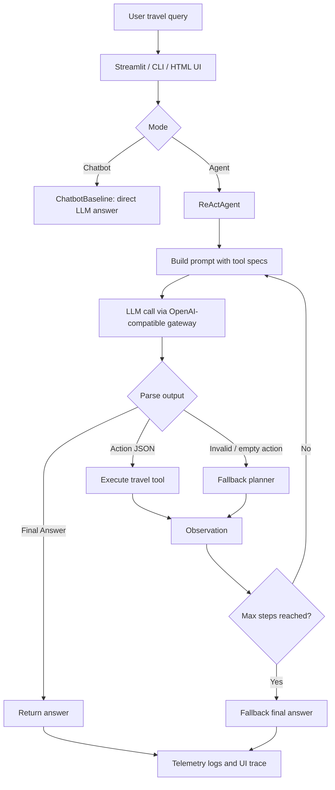

# Group Report: Lab 3 - Production-Grade Agentic System

- **Team Name**: Vin Travel Concierge Agent
- **Team Members**:
  - Trần Quốc Khánh - 2A202600679
  - Nguyễn Anh Kiệt - 2A202600677
  - Nguyễn Văn Huy - 2A202600773
  - Nhan Khánh Đình - 2A202600673
  - Nguyễn Ngọc Hảo - 2A202600903
- **Deployment Date**: 2026-06-01
- **Demo Domain**: Vin/Vinpearl/VinWonders travel concierge for Phú Quốc and Nha Trang

---

## 1. Executive Summary

The project implements a direct chatbot baseline and a ReAct-style agent for the same travel planning task. The baseline answers from the LLM directly, while the agent can call structured travel tools, collect observations, and produce an itinerary with cost estimate, warnings, and source URLs.

- **Success Rate**: 17/17 automated checks passed on the final codebase; controlled demo cases cover normal planning, out-of-domain guardrail, internal-tool question guardrail, parser fallback, and max-step fallback.
- **Key Outcome**: The ReAct agent produces more reliable multi-step Vin travel answers than the baseline because it grounds hotel, ticket, and itinerary details through tools instead of relying only on free-form LLM generation.
- **Target Coverage**: Chatbot Baseline, Agent v1, Agent v2, Tool Evolution, Trace Quality, Evaluation, Flowchart, Code Quality, Monitoring, Failure Handling, and Demo UI are all covered.

---

## 2. System Architecture & Tooling

### 2.1 ReAct Loop Implementation

The agent follows `Thought -> Action -> Observation -> Final Answer` with:

- `max_steps` guard to prevent infinite loops and runaway cost.
- Action parser for `tool_name({...json...})`.
- Unknown tool handling through structured error observation.
- Fallback planner when the model returns malformed or empty action text.
- Domain guard for non-travel questions.
- Internal prompt/tool guard so hidden tools and system instructions are not exposed in the answer.

### 2.2 Tool Definitions (Inventory)

| Tool Name | Input Format | Use Case |
| :--- | :--- | :--- |
| `hotel_lookup` | JSON: `destination`, `group_type`, `budget_vnd`, `nights` | Find suitable Vinpearl/VinHolidays hotel options with mock price, area, highlights, source URL, and warning. |
| `ticket_offer_lookup` | JSON: `destination`, `adults`, `children`, `date` | Estimate VinWonders/Safari ticket cost for a group and return subtotal with source URL. |
| `itinerary_planner` | JSON: `destination`, `days`, `nights`, `adults`, `children`, `budget_vnd`, `preferences` | Build a day-by-day Phú Quốc/Nha Trang itinerary with estimated cost, sources, and warnings. |

### 2.3 LLM Providers Used

- **Primary**: `xmtp/mimo-v2.5` through OpenAI-compatible local gateway `http://localhost:20128/v1`.
- **Secondary (Backup)**: `xmtp/mimo-v2.5-pro` through the same gateway.
- **Configuration**: API key and model are read from `.env`; keys are not hardcoded and are not printed to logs.

---

## 3. Telemetry & Performance Dashboard

The final implementation records telemetry in `logs/YYYY-MM-DD.log` and displays the same information in the Streamlit UI.

Metrics observed from the 2026-06-01 log:

- **OpenAI-compatible LLM calls logged**: 141
- **Average Latency**: 9,213 ms
- **P50 Latency**: 6,842 ms
- **Max Latency**: 79,349 ms
- **Average Tokens per LLM Call**: 3,421
- **Estimated Total Cost Logged**: $1.45563225
- **Agent End Events**: 111
- **Average Agent Loop Count**: 1.77 steps
- **Tool Calls Logged**: 111

Tool call distribution:

| Tool | Calls |
| :--- | ---: |
| `hotel_lookup` | 56 |
| `itinerary_planner` | 31 |
| `ticket_offer_lookup` | 24 |

Final status distribution from agent logs:

| Status | Count | Interpretation |
| :--- | ---: | :--- |
| `success` | 67 | Clean ReAct completion with final answer. |
| `fallback_final` | 11 | Agent still returned a usable answer from gathered observations. |
| `direct_answer` | 1 | Travel answer did not need a tool. |
| `max_steps` | 25 | Guardrail prevented unbounded loops. |
| `parse_error` | 6 | Invalid model output detected. |
| `llm_error` | 1 | Provider/runtime failure handled without crashing. |

Guardrail events:

| Event | Count | Purpose |
| :--- | ---: | :--- |
| `AGENT_OUT_OF_DOMAIN` | 9 | Reject unrelated non-travel requests. |
| `AGENT_INTERNAL_QUESTION` | 11 | Avoid revealing tools/system prompt in user-facing answer. |
| `CHATBOT_OUT_OF_DOMAIN` | 6 | Baseline is constrained to Vin travel domain. |
| `CHATBOT_INTERNAL_QUESTION` | 7 | Baseline also avoids exposing internals. |
| `AGENT_PARSE_FALLBACK` | 28 | Parser/fallback recovery for malformed or missing ReAct actions. |

---

## 4. Root Cause Analysis (RCA) - Failure Traces

### Case Study 1: Out-of-Domain Free-Style Answer

- **Input**: "Giáo trình học AI cho sinh viên bách khoa dưới 5 triệu"
- **Initial Observation**: The LLM could answer this as a normal education-budget request, but that violates the selected Vin travel domain.
- **Root Cause**: A general-purpose LLM tends to follow any helpful user request unless the app layer enforces a product boundary.
- **Fix in Agent v2**: Added domain guard before LLM call. Non-travel questions now return a short redirect to Vin/Vinpearl/VinWonders travel planning.
- **Evidence**: `AGENT_OUT_OF_DOMAIN` and `CHATBOT_OUT_OF_DOMAIN` events are logged; tests assert the answer does not include the unrelated education content.

### Case Study 2: User Asked Which Tool Was Used

- **Input**: "Bạn đã dùng tool gì để lên kế hoạch trên?"
- **Initial Observation**: A raw LLM answer may expose tool inventory or internal implementation details.
- **Root Cause**: User-facing answer and debugging trace were not clearly separated.
- **Fix in Agent v2**: Added internal-tool/system-prompt guard. The chat answer does not list internal tools; the Streamlit UI shows execution details in the trace panel below the answer.
- **Evidence**: `AGENT_INTERNAL_QUESTION` and `CHATBOT_INTERNAL_QUESTION` events are logged; automated tests assert `hotel_lookup` and `system prompt` are not revealed in the answer.

### Case Study 3: Malformed / Missing ReAct Action

- **Input**: Travel request where the model returned blank content or multiple actions in a single turn.
- **Observation**: The parser could not safely execute the intended action.
- **Root Cause**: Small/fast models may not follow a strict ReAct schema consistently.
- **Fix in Agent v2**: Added deterministic fallback routing based on query features: destination, days, people, budget, and preferences. The fallback calls `hotel_lookup`, `ticket_offer_lookup`, and `itinerary_planner` in a safe order.
- **Evidence**: `AGENT_PARSE_FALLBACK` events appear in telemetry; final answers can still be built from tool observations.

### Case Study 4: Max-Step Timeout

- **Input**: Repeated planning request where the model kept asking for more tool calls.
- **Observation**: Without a step cap, the loop could waste latency and cost.
- **Root Cause**: ReAct loops need explicit termination control.
- **Fix in Agent v2**: `max_steps` stops the loop and returns a fallback answer from observations already collected.
- **Evidence**: `max_steps` status appears in logs and has automated coverage.

---

## 5. Ablation Studies & Experiments

### Experiment 1: Prompt v1 vs Prompt v2

- **Prompt v1**: Basic ReAct instruction with tool list and action format.
- **Problem**: Model sometimes returned direct prose, blank text, or multiple actions.
- **Prompt v2**: Added stricter rules: one step only, raw JSON in action parentheses, never invent observation, and use tools for concrete travel facts.
- **Result**: ReAct behavior became easier to parse and monitor. Remaining failures are recovered by deterministic fallback logic.

### Experiment 2: Agent v1 vs Agent v2

| Capability | Agent v1 | Agent v2 | Result |
| :--- | :--- | :--- | :--- |
| ReAct loop | Basic loop | Loop with parser, max steps, final answer extraction | v2 better |
| Tool handling | Executes valid actions | Adds unknown-tool and malformed-action fallback | v2 better |
| Domain safety | Mostly prompt-based | App-level guard before LLM call | v2 better |
| Internal tool leakage | Possible | Guarded answer plus trace panel | v2 better |
| Cost/latency monitoring | Basic logs | Token, latency, cost, LLM call, tool call, loop count | v2 better |

### Experiment 3: Chatbot vs Agent

| Case | Chatbot Result | Agent Result | Winner |
| :--- | :--- | :--- | :--- |
| Simple VinWonders FAQ | Can answer directly, but may be generic | Can answer directly or tool-ground when needed | Draw |
| Phú Quốc 3 days, 3 people, 10M budget, beach preference | May hallucinate prices or miss sources | Calls travel tools and returns itinerary, cost, warning, sources | **Agent** |
| Nha Trang 2 days, 5M budget | Gives general suggestion | Uses itinerary/hotel/ticket observations and flags budget pressure | **Agent** |
| Out-of-domain education budget | Now redirects because of guard | Redirects because of guard | Draw |
| Asked "what tool did you use?" | Refuses to expose internals | Refuses in answer, shows trace below chat | **Agent** |

---

## 6. Production Readiness Review

- **Security**: API keys are read from `.env` only. The app does not print secrets in normal logs. Internal tools, raw schemas, and system prompt are not exposed in final chat answers.
- **Guardrails**: Domain guard, internal-tool guard, max-step limit, unknown-tool error observation, and fallback answer builder are implemented.
- **Monitoring**: JSON logs include LLM call metrics, token usage, estimated cost, latency, tool call events, loop count, and error/fallback events. Streamlit shows these traces under each message.
- **Code Quality**: The system is modular: provider layer, provider factory, chatbot baseline, ReAct agent, tools, telemetry, CLI demo, HTTP backend, and Streamlit UI are separated.
- **Testing**: The final suite validates parser behavior, final answer detection, unknown tool handling, max-step fallback, provider config mapping, travel tool outputs, domain guard, and internal-tool guard.
- **Scaling Path**: For production, replace mock data with official APIs or RAG over verified Vinpearl/VinWonders documents, add persistent session storage, add evaluation datasets, and move the agent graph to LangGraph or a similar state-machine framework.

---

## 7. Contribution Breakdown

| Member | Student ID | Main Responsibility | Concrete Output |
| :--- | :--- | :--- | :--- |
| Trần Quốc Khánh | 2A202600679 | Agent Core and integration | ReAct loop, parser flow, final answer handling, Streamlit/HTML demo integration, final validation. |
| Nguyễn Anh Kiệt | 2A202600677 | Tools and mock data | `hotel_lookup`, `ticket_offer_lookup`, `itinerary_planner`, Phú Quốc/Nha Trang mock data, source URL and warning format. |
| Nguyễn Văn Huy | 2A202600773 | Provider/config layer | OpenAI-compatible gateway setup, `.env` parsing, `xmtp/mimo-v2.5` and `xmtp/mimo-v2.5-pro` model selection, CLI flags. |
| Nhan Khánh Đình | 2A202600673 | Telemetry and tests | Token/latency/cost tracking, JSON event logs, parser/provider/tool tests, failure trace collection. |
| Nguyễn Ngọc Hảo | 2A202600903 | Report and demo script | Group report, rubric mapping, successful/failed trace documentation, live demo checklist. |

---

> [!NOTE]
> Submit this report by renaming it to `GROUP_REPORT_[TEAM_NAME].md` and placing it in this folder.
